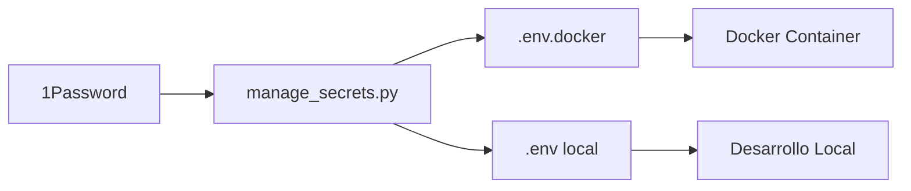

# CodeSemio Platform - Deployment Guide

## 🔐 Gestión de Secretos con 1Password

### Configuración Inicial

1. **Instalar 1Password CLI**
   ```bash
   # macOS
   brew install --cask 1password-cli
   
   # Linux (descarga desde)
   https://1password.com/downloads/command-line/
   ```

2. **Configurar 1Password**
   ```bash
   # Iniciar sesión
   op signin
   
   # Verificar conexión
   op vault list
   ```

3. **Crear Vault 'CodeSemio'**
   - En 1Password, crear un nuevo vault llamado "CodeSemio"
   - Añadir los siguientes items:
     - **OpenAI API**: Campo `credential` con tu API key
     - **Anthropic API**: Campo `credential` con tu API key
     - **Mistral API**: Campo `credential` con tu API key
     - **MongoDB Atlas**: Campo `connection_string` con la URI completa

### Uso del Script de Gestión

```bash
# Ver instrucciones de configuración
python manage_secrets.py --setup

# Verificar que todos los secretos estén configurados
python manage_secrets.py --check

# Exportar secretos para Docker
python manage_secrets.py --export-docker

# Configuración completa de Docker
python manage_secrets.py --docker-setup
```

## 🐳 Despliegue con Docker

### Desarrollo Local

1. **Verificar secretos**
   ```bash
   python manage_secrets.py --check
   ```

2. **Generar archivo de secretos para Docker**
   ```bash
   python manage_secrets.py --export-docker
   ```

3. **Construir y ejecutar**
   ```bash
   # Construir imagen
   docker-compose build
   
   # Iniciar plataforma
   docker-compose up -d
   
   # Ver logs
   docker-compose logs -f codesemio-platform
   ```

### Despliegue en DataSource Host

1. **Transferir archivos al servidor**
   ```bash
   # Copiar código fuente
   scp -r src/ user@datasource-host:/path/to/codesemio/
   scp requirements.txt user@datasource-host:/path/to/codesemio/
   scp Dockerfile docker-compose.yml user@datasource-host:/path/to/codesemio/
   ```

2. **Generar secretos en el servidor**
   ```bash
   # En el servidor DataSource
   ssh user@datasource-host
   cd /path/to/codesemio
   
   # Generar .env.docker con los secretos
   python manage_secrets.py --export-docker
   ```

3. **Construir y ejecutar en el servidor**
   ```bash
   # Construir imagen
   docker-compose build
   
   # Iniciar con reinicio automático
   docker-compose up -d
   
   # Verificar estado
   docker-compose ps
   docker-compose logs --tail=100
   ```

## 📝 Configuración de Secretos

### Variables de Entorno Requeridas

| Variable | Descripción | Requerido |
|----------|-------------|-----------|
| `MONGODB_URI` | URI de conexión a MongoDB Atlas | ✅ |
| `OPENAI_API_KEY` | API Key de OpenAI | ✅ |
| `ANTHROPIC_API_KEY` | API Key de Anthropic | ⚠️ Opcional |
| `MISTRAL_API_KEY` | API Key de Mistral | ⚠️ Opcional |
| `DB_NAME` | Nombre de la base de datos | ✅ |
| `DEFAULT_APP` | Aplicación por defecto | ✅ |
| `DEFAULT_MODEL` | Modelo LLM por defecto | ✅ |

### Flujo de Secretos



## 🔄 Actualización de Secretos

### Cuando cambias un secreto en 1Password:

1. **Regenerar archivo de Docker**
   ```bash
   python manage_secrets.py --export-docker
   ```

2. **Reiniciar contenedor**
   ```bash
   docker-compose restart
   ```

### Rotación de credenciales:

1. Actualizar en 1Password
2. Regenerar `.env.docker`
3. Desplegar nueva versión
4. Verificar funcionamiento
5. Eliminar credenciales antiguas

## 🛡️ Seguridad

### Mejores Prácticas

1. **NUNCA commits `.env.docker` a Git**
   - Ya está en `.gitignore`
   - Permisos 600 (solo owner puede leer/escribir)

2. **Usar 1Password como fuente única de verdad**
   - No hardcodear credenciales
   - No copiar/pegar en múltiples lugares

3. **Rotación regular de credenciales**
   - Cambiar API keys cada 90 días
   - Actualizar MongoDB passwords regularmente

4. **Logs y auditoría**
   - Revisar logs de acceso
   - Monitorear uso de API keys

## 🚨 Troubleshooting

### Error: "1Password CLI not found"
```bash
# Instalar 1Password CLI
brew install --cask 1password-cli

# Verificar instalación
op --version
```

### Error: "Secret not found"
```bash
# Verificar que el item existe en 1Password
op item get "OpenAI API" --vault CodeSemio

# Verificar campos
op item get "OpenAI API" --vault CodeSemio --format json | jq '.fields'
```

### Error: "Docker permission denied"
```bash
# Asegurar que el usuario está en el grupo docker
sudo usermod -aG docker $USER

# Reiniciar sesión
newgrp docker
```

## 📊 Monitoreo

### Health Check
```bash
# Verificar estado del contenedor
docker-compose ps

# Test manual del health check
curl http://localhost:8000/health
```

### Logs
```bash
# Ver todos los logs
docker-compose logs

# Seguir logs en tiempo real
docker-compose logs -f

# Últimas 100 líneas
docker-compose logs --tail=100
```

## 🔄 CI/CD Pipeline (Opcional)

### GitHub Actions Example
```yaml
name: Deploy to DataSource

on:
  push:
    branches: [main]

jobs:
  deploy:
    runs-on: ubuntu-latest
    steps:
      - uses: actions/checkout@v2
      
      - name: Deploy to server
        uses: appleboy/ssh-action@master
        with:
          host: ${{ secrets.DATASOURCE_HOST }}
          username: ${{ secrets.DATASOURCE_USER }}
          key: ${{ secrets.SSH_KEY }}
          script: |
            cd /path/to/codesemio
            git pull
            python manage_secrets.py --export-docker
            docker-compose up -d --build
```

## 📚 Referencias

- [1Password CLI Documentation](https://developer.1password.com/docs/cli)
- [Docker Compose Documentation](https://docs.docker.com/compose/)
- [MongoDB Atlas Connection Strings](https://docs.atlas.mongodb.com/reference/connection-string/)

---

**Última actualización**: 9 de Septiembre 2025
**Versión**: 1.0.0